<div align="center">



# FLOW TOOLCHAIN

### A developer request activates focused Flow skills that guide Cadence authoring, testing, auditing, and network workflows.

[Start here](#start-here) · [Original project documentation](#original-project-documentation)

</div>

## Start here

You do not need to understand the whole codebase first. Follow the illuminated path in the graphic:

**01 — Describe the task** →  **02 — Select a Flow skill** →  **03 — Write Cadence or app code** →  **04 — Test and audit** →  **05 — Use Flow tooling**

| What you are looking at | Plain-English meaning |
|---|---|
| **Input** | What the user or system supplies |
| **Core** | The repository’s main processing loop |
| **Guardrails** | Configuration, policy, filters, or approval boundaries |
| **Output** | The result the system returns or deploys |
| **Proof** | Tests, reports, previews, logs, or other visible evidence |

> **Status, stated plainly:** This fork preserves Flow’s upstream plugin content and attribution. The Sonoxo layer is documentation presentation only unless an integration is explicitly implemented.

<details>
<summary><strong>Accessibility and motion</strong></summary>

The hero is a native SVG with descriptive text. Animation automatically stops when your device enables **Reduce Motion**. No JavaScript, tracking code, video autoplay, or external image host is required.

</details>

---

## Original project documentation

# flow-ai-tools — Claude Code Plugin for Flow Network Development

AI tools for the [Flow network](https://github.com/onflow) ecosystem. These [Claude Code](https://claude.ai/code) plugins provide domain-specific skills that help Claude Code write better Cadence and Flow code.

## Quick Start

Set up your entire Flow development environment with one command:

```bash
sh -ci "$(curl -fsSL https://raw.githubusercontent.com/onflow/flow-ai-tools/main/scripts/install.sh)"
```

This installs the **Flow CLI**, configures the **Cadence MCP** server for Claude Code, and adds the **flow-dev** plugin with all its skills.

## Manual Installation

Add this marketplace to Claude Code:

```bash
/plugin marketplace add onflow/flow-ai-tools
```

Then install individual plugins:

```bash
/plugin install flow-dev@flow-ai-tools
```

## Available Plugins

| Plugin | Description | Skills | Category |
|--------|-------------|--------|----------|
| **flow-dev** | Flow network development | `cadence-lang`, `cadence-tokens`, `cadence-audit`, `cadence-scaffold`, `cadence-testing`, `flow-react-sdk`, `flow-project-setup`, `flow-cli`, `flow-dev-setup`, `flow-defi`, `flow-tokenomics` | blockchain |

### flow-dev

Skills for developing on the Flow network:

| Skill | Description |
|-------|-------------|
| `cadence-lang` | Cadence language fundamentals: access control, entitlements, resources, contracts, transactions, interfaces, accounts, references, capabilities, pre/post conditions, security best practices (checks-effects-interactions, trust-boundary validation, bounded loops), anti-patterns, design patterns, style and readability, and numeric precision with checked arithmetic |
| `cadence-tokens` | NFT and FT token development: NonFungibleToken/FungibleToken interface conformance, MetadataViews integration, collection patterns, modular NFT architectures |
| `cadence-audit` | Smart contract audit and review: security vulnerabilities, severity-rated findings, structured review format, project-wide audit workflow |
| `cadence-scaffold` | Interactive code generation: scaffold production-ready contracts, transactions, and DeFi transactions with proper security patterns |
| `cadence-testing` | Cadence unit testing: Test contract API, assertions and matchers, blockchain emulation, events, coverage, `flow test`, testing patterns |
| `flow-react-sdk` | React frontend development: FlowProvider setup, Cadence hooks (query, mutate, auth, events), Cross-VM hooks (EVM bridging, batch transactions), UI components (Connect, TransactionButton, NftCard) |
| `flow-project-setup` | Flow project configuration: flow.json setup, FCL frontend integration, CLI workflow, deployment, debugging, gas optimization, testnet validation |
| `flow-cli` | Flow CLI reference: full command list, account management, query blockchain (accounts/blocks/events/transactions), Cadence script recipes, MCP server setup |
| `flow-dev-setup` | Development environment setup: Flow CLI installation, emulator, VS Code extension, testing framework, dev wallet, frontend SDKs (FCL/React), EVM tooling (Hardhat/Foundry/Remix) |
| `flow-defi` | Flow DeFi architecture and protocol safety: COAs, MEV-free EVM, cross-VM atomicity, lending health factor/kink models, AMM type selection, liquidity bootstrapping benchmarks, veFLOW, Merkl, ecosystem map, oracle sourcing, foreign-contract assumptions, emergency stops |
| `flow-tokenomics` | Token economics: Fisher Equation, Nash equilibrium, proven patterns (Real Yield/Buyback/veToken) with failure case studies, TGE 12-week playbook, DAO governance attack vectors, Howey Test, MiCA compliance |

## Repository Structure

```
.claude-plugin/
    marketplace.json        # Marketplace catalog
plugins/
    flow-dev/
        .claude-plugin/
            plugin.json     # Plugin metadata
        skills/
            cadence-lang/
                SKILL.md    # Cadence language guide
                references/ # 18 reference files
            cadence-tokens/
                SKILL.md    # Token development guide
                references/ # 2 reference files
            cadence-audit/
                SKILL.md    # Audit guide
                references/ # 2 reference files
            cadence-scaffold/
                SKILL.md    # Code generation guide
                references/ # 3 reference files
            cadence-testing/
                SKILL.md    # Testing framework guide
                references/ # 6 reference files
            flow-react-sdk/
                SKILL.md    # React SDK guide
                references/ # 4 reference files
            flow-project-setup/
                SKILL.md    # Project setup guide
                references/ # 2 reference files
            flow-cli/
                SKILL.md    # CLI reference guide
                references/ # 6 reference files
            flow-dev-setup/
                SKILL.md    # Dev environment setup guide
                references/ # 8 reference files
            flow-defi/
                SKILL.md    # DeFi architecture and safety guide
                references/ # 5 reference files
            flow-tokenomics/
                SKILL.md    # Tokenomics guide
                references/ # 5 reference files
```

## Contributing

### Adding a new plugin

1. Create a directory under `plugins/<plugin-name>/`
2. Add `.claude-plugin/plugin.json` with plugin metadata:
   ```json
   {
     "name": "your-plugin",
     "description": "What your plugin does",
     "version": "1.0.0",
     "author": { "name": "Your Name" }
   }
   ```
3. Add skills under `skills/<skill-name>/SKILL.md` with YAML frontmatter:
   ```yaml
   ---
   name: your-skill-name
   description: When this skill should be activated
   ---
   ```
4. Register the plugin in `.claude-plugin/marketplace.json` by adding an entry to the `plugins` array
5. Validate with `claude plugin validate .`

### Adding a skill to an existing plugin

1. Create `plugins/<plugin-name>/skills/<skill-name>/SKILL.md`
2. Add YAML frontmatter with `name` and `description`
3. Write the skill body with patterns, code examples, and common mistakes

## About Flow

This repo is part of the [Flow network](https://flow.com), a Layer 1 blockchain built for consumer applications, AI agents, and DeFi at scale.

- Developer docs: https://developers.flow.com
- Cadence language: https://cadence-lang.org
- Community: [Flow Discord](https://discord.gg/flow) · [Flow Forum](https://forum.flow.com)
- Governance: [Flow Improvement Proposals](https://github.com/onflow/flips)
